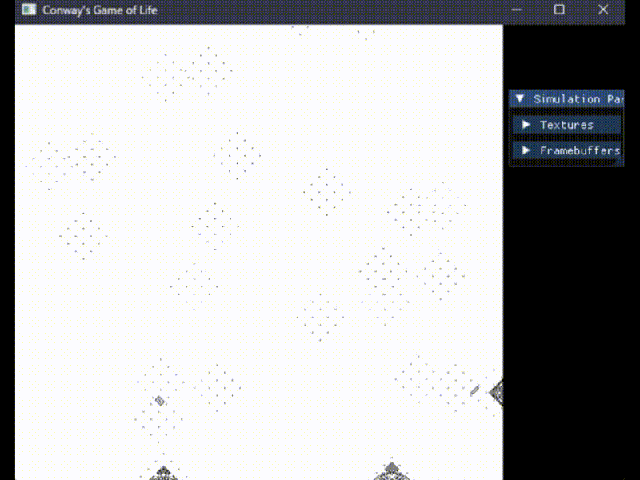

# Conway's Game of Life

An implementation of Conway's Game of Life, utilizing OpenGL and GLSL to run the
simulation on the GPU.

## Prerequisites

- [GLFW](https://www.glfw.org/)
- [spdlog](https://github.com/gabime/spdlog)

### Other Included Libraries

For transparency, the following libraries are already included in the codebase:

- [Dear ImGui](https://github.com/ocornut/imgui)
- [GLAD](https://github.com/Dav1dde/glad)

## About

This implementation uses OpenGL to leverage the GPU for the drawing and processing
of the game. I've setup 2 framebuffers to contain the state of the game, which
are both updated each frame to calculate the previous and current state.

I've implemented the basic rules defined here: https://en.wikipedia.org/wiki/Conway%27s_Game_of_Life

## Building

### MSVC 2019

Run the command: `.\build.bat`

## Running

Ensure the proper DLL files are included in your `PATH` when running the executable:

- `glfw3.dll`
